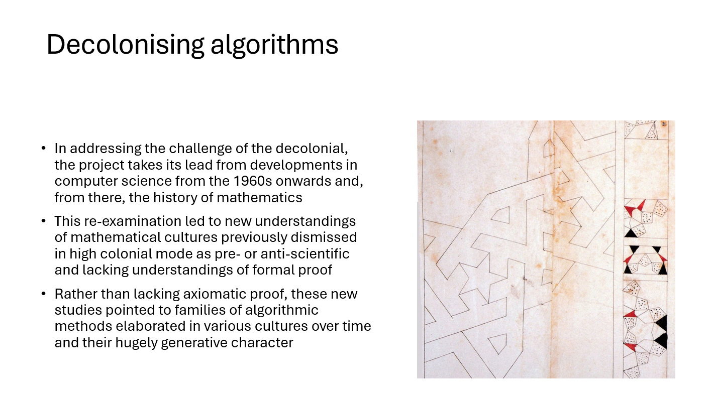
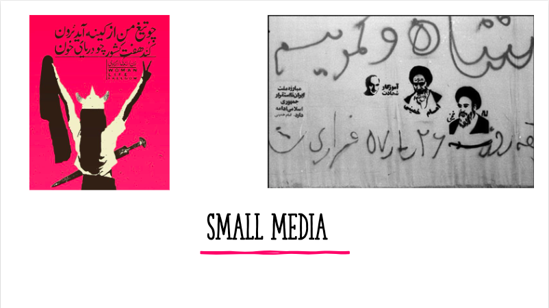
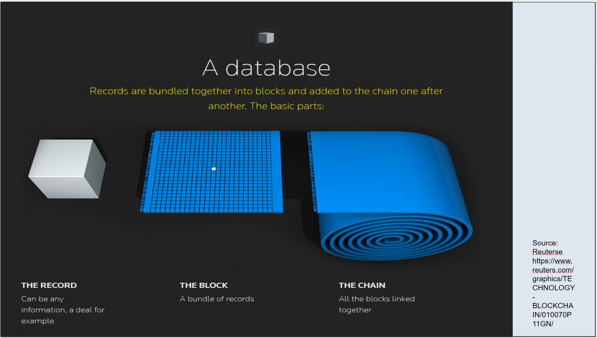
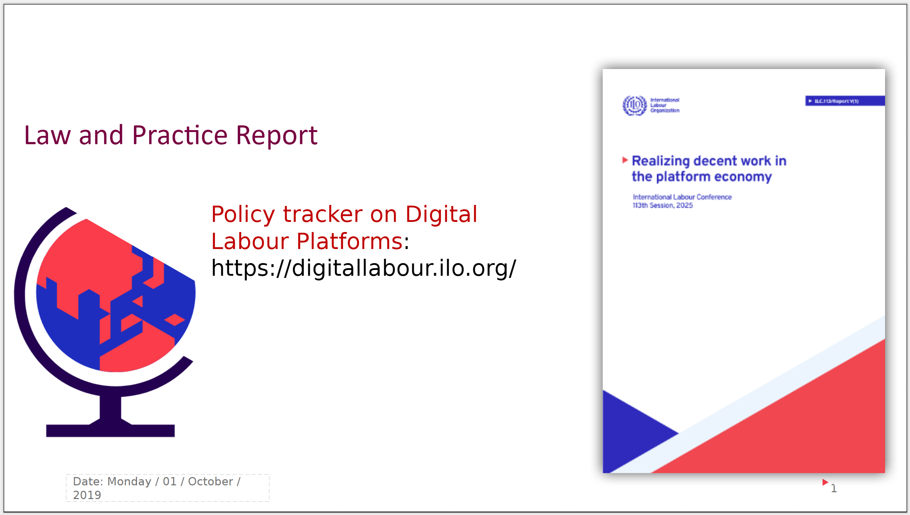
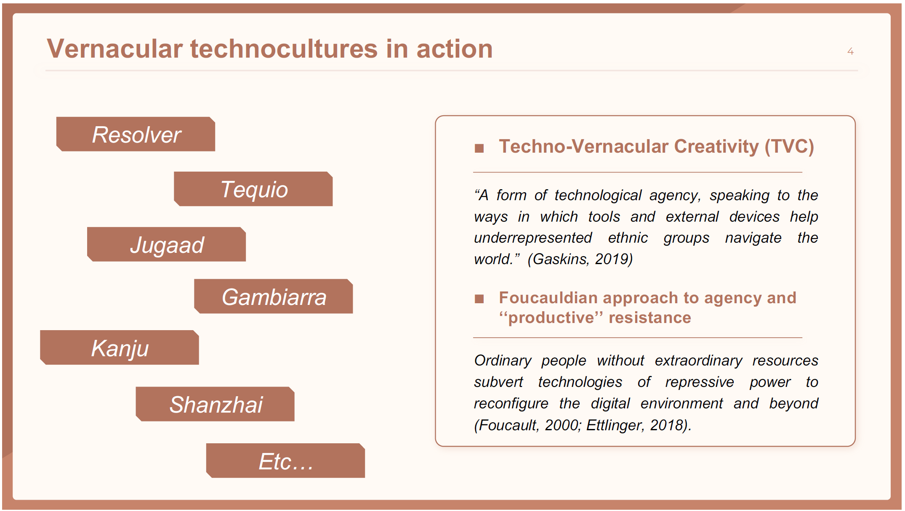

# July 3, 2026 - A Report on the Conference [Digital Humanities Today: Critical Inquiry with and about the Digital](https://kcldigitalconference.com/)
### (23-26 June 2026, King's College, London)

Having survived the massive heat wave in London during the last week of June, I am sitting at Heathrow Airport, enjoying a smoothie and reflecting on four days of intensive and fruitful talks and conversations at the Digital Conference at King's College London. Having attended several Digital Humanities conferences across Europe, I can confidently say that the conference in London differed from all of them and stood out in multiple ways. Through this report, I would like to share my experience with the DH community, hoping to pass on some of the valuable insights and inspiration I gained from this conference.

The first outstanding characteristic of this conference was, from my perspective, its multidisciplinarity. Digital Humanities is interdisciplinary by nature because both of its components—"digital" and "humanities"—encompass a broad range of scholarly fields. However, perhaps due to the organizers' understanding of the field's scope, most DH conferences I have attended so far have tended to focus more strongly on methods and tools. This is by no means a criticism, as these aspects are undoubtedly central to Digital Humanities. At the same time, however, such a focus does not fully capture the breadth of the field and its enormous potential. Whereas many other conferences primarily highlighted data and metadata annotation, generation, and publication, as well as the application of stochastic machine-learning-based computer programs (or "tools," as DH scholars have come to call them) in humanities research, the conference at King's College embraced these topics while simultaneously offering a much broader perspective. In the following paragraphs, I provide an overview of the diverse panels and presentations I attended.

In my own talk, I presented a critical perspective on contemporary approaches to Digital Humanities and discussed strategies that can help researchers avoid some of the field's common pitfalls. The panels I attended explored the history and philosophy of algorithms from a decolonial perspective (Slide 1). Others focused on the digital platforms that constitute what we know as social media (such as Instagram and X), examining how the sharing and resharing of certain images shapes online communities centered around particular topics (Slide 2). Another presentation examined how the history of blockchain technology reflects the recurring cycle of utopian and dystopian narratives that have shaped the public imagination surrounding new digital technologies, including AI (Slide 3).

*Slide 1 - Sabreen Syeed, Phillip Brooker, Michael Mair, Leon Moosavi, Geraldine Reid - Algorithms, Social Practice and the Epistemic Decolonisation of the Computational*

*Slide 2 - Sahar Sagha - Chords of Small Media Through Time*

*Slide 3 - Timothy Jordan - The Four Phases of Blockchain Technology and the Internet’s Imaginary*

Other multidisciplinary panels, featuring scholars alongside human rights experts from the International Labour Organization (ILO), addressed ongoing international efforts to improve the working conditions of platform workers, such as Uber drivers. These discussions focused on emerging legal frameworks designed to oblige states to ensure fair working conditions and promote more human, rather than algorithmic, forms of communication between workers and their employers (Slide 4).

*Slide 4 - Uma Rani, Luciana Zorzoli, Aditya Ray - Governing Platforms, Shaping Work: Critical Perspectives on the State and its Role in Regulating the Gig and Platform Economy*

Further presentations adopted a sociological perspective on digital folklore, exploring how digital platforms host a new generation of artists and content creators who are reshaping public discourse around queerness while simultaneously reviving elements of their countries' traditional folklore. There were also talks about the relative absence of digital technologies in many non-European and non-North American societies and how these communities develop alternatives to products offered by large technology companies that are better tailored to their own social and cultural needs (Slide 5).

*Slide 5 - Shuxian Liu, Dr. Edgar Gómez-Cruz - Vernacular Theories: Building Technocultures from the Global South*

Finally, there was a great deal of critical and philosophical reflection on the tools, methods, and approaches currently employed in Digital Humanities. In my opinion, this was one of the conference's greatest strengths compared to many other DH conferences, which are often dominated by enthusiasm for machine learning and statistical methods made available to the humanities through computational technologies.

This remarkable multidisciplinarity was reflected in the lively dialogue among scholars from an exceptionally diverse range of disciplines, including literary studies, philosophy, science and technology studies, game studies, media studies, economics, sociology, musicology, art history, architecture, urbanism, geography, and computer science. The concept of the "digital" served as a common thread that brought these diverse perspectives together and, I am sure, inspired everyone with new ideas and approaches.

The second outstanding aspect of the conference that I would like to highlight was its international character. Whereas the DH conferences I had previously attended were composed predominantly of scholars from Europe and North America, the conference in London welcomed contributions from researchers representing all inhabited continents. It was extremely inspiring to learn how institutions around the world approach Digital Humanities and to discover the diverse research traditions and priorities that shape the field in different regions. I believe that it was precisely the conference's multidisciplinary character that made it possible to accommodate such a wide variety of perspectives on Digital Humanities.

I would like to thank the organizers of this outstanding conference for creating such a rich, multidisciplinary, and decolonial program. It was an immensely enriching and inspiring experience to learn about so many fascinating projects and to exchange ideas with colleagues from around the world. I am also very grateful to DHd (Digital Humanities im deutschsprachigen Raum) for partially funding my travel to London and making it possible for me to attend this conference.
