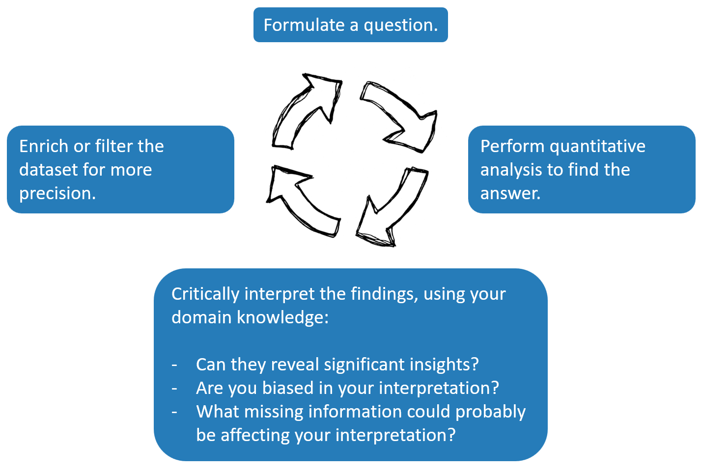

## 1. Links and materials

### Visit the website of MoMA
Open [this link](https://www.moma.org/) in a new tab to visit the website of MoMa (Museum of Modern Art).

### Download the dataset
Click [this link](https://raw.githubusercontent.com/Goli-SF/uzh_demo/main/data/moma_artworks_geodata.zip) to download the dataset. Unzip the downloaded file on your computer.

### Download and install OpenRefine
Open [this link](https://openrefine.org/download) in a new tab to download OpenRefine. Unzip the downloaded file on your computer and then run `openrefine.exe`.

### Use Kepler.gl for geospatial analysis
Open [this link](https://kepler.gl/) in a new tab to start using Kepler.gl.

### Use Python for data visualization
Open [this link](https://mybinder.org/v2/gh/Goli-SF/uzh_demo/main?urlpath=%2Fdoc%2Ftree%2Fvisualize_mies_works.ipynb) in a new tab to create a bar chart displaying the count of Mies van der Rohe's works in the MoMA collection based on their creation date.

 

## 2. The exploratory data analysis workflow

